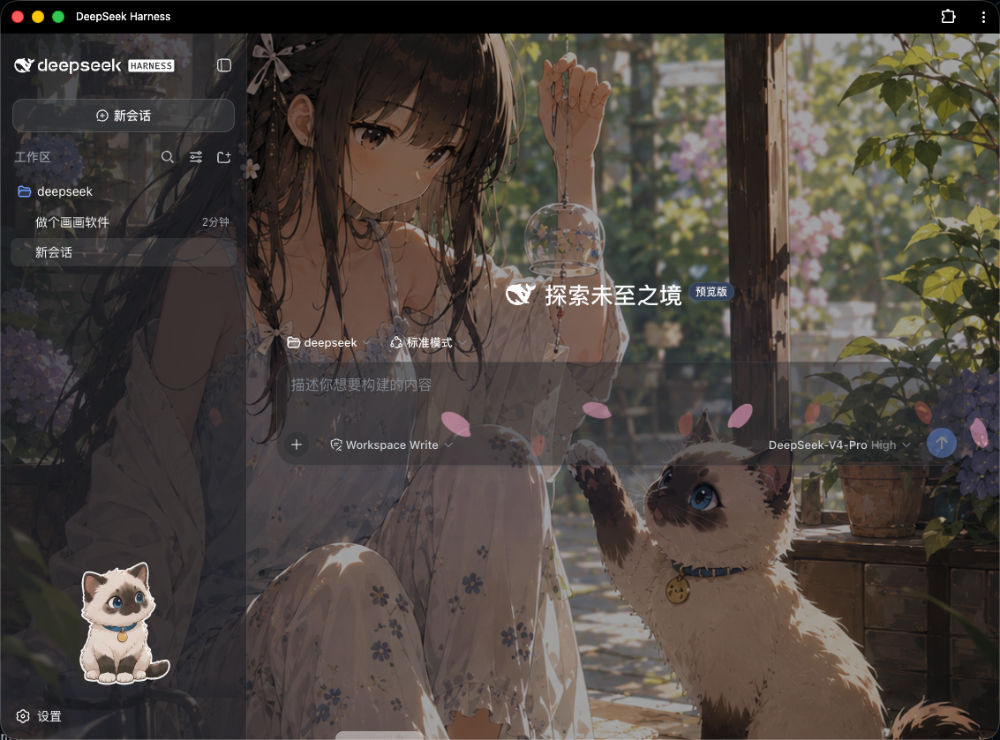

# DeepSeek Harness 壁纸主题 · Wallpaper Theme Plugin

> **[English](#english) · [中文](#chinese)**

A client-side theme plugin that gives [DeepSeek Harness](https://github.com/deepseek-ai/deepseek-harness) a wallpaper background and semi-transparent panels.



<a id="english"></a>

## English

### What it does

- Full-page wallpaper background (cover, centered, fixed)
- Semi-transparent panels so the wallpaper shows through
- Works with both light and dark themes
- Pure client plugin — no host changes, safe to uninstall

### Requirements

- DeepSeek Harness installed and runnable via `dsh web`
- Nothing else — the plugin is self-contained (the background image is embedded)

### Installation

**Step 1 — Download the plugin.** Either clone it:

```bash
git clone https://github.com/xiaoloveying/deepseek_harness_theme \
  ~/.dsh/profiles/node_modules/dsh-theme-wallpaper
```

or download the ZIP (**Code → Download ZIP**), unzip it, copy the folder into `~/.dsh/profiles/node_modules/`, and rename it to `dsh-theme-wallpaper`.

> If your Harness home is not `~/.dsh` (you set `DSH_HOME`), use your actual path instead.

**Step 2 — Register the plugin.** Edit `~/.dsh/profiles/web/cordis.patch.yml` (change `web` to your profile name if different):

```yaml
- insert:
    - id: theme-wallpaper
      name: dsh-theme-wallpaper
```

If the file already has content, append the block above to the end (keep the YAML indentation).

**Step 3 — Restart** and hard-refresh:

```bash
dsh web
```

Then press `Cmd + Shift + R` (`Ctrl + Shift + R` on Windows/Linux).

### One-command installer

```bash
./install.sh           # default profile: web
./install.sh myprofile # use a different profile
```

The script copies the plugin and writes `cordis.patch.yml` for you; then just restart `dsh web`.

### Uninstall

1. Remove the `- insert: ...` block you added in `cordis.patch.yml`.
2. Delete the plugin folder:

   ```bash
   rm -rf ~/.dsh/profiles/node_modules/dsh-theme-wallpaper
   ```

3. Restart `dsh web`.

### Customization

All styles live in `lib/client.js`.

**Change the wallpaper** — replace the base64 in `var BG = "data:image/jpeg;base64,..."` with your own image:

```bash
base64 -i your-image.jpg | tr -d '\n'
# append the output after "data:image/jpeg;base64,"
```

**Tune panel opacity** — edit the last number (0–1, higher = more solid) of these variables:

| Variable | Controls |
|---|---|
| `--dsw-alias-bg-base` | Main-area mask |
| `--dsw-specific-sidebar-fill` | Sidebar |
| `--dsw-alias-button-elevated-fill` | New-session button |
| `--dsw-specific-input-major` | Input / composer box |
| `--dsw-alias-bg-layer-1/2/3` | Panels, dialogs, etc. |

Restart `dsh web` to apply.

### Files

| File | Description |
|---|---|
| `package.json` | Plugin manifest declaring `dsh.client` |
| `lib/index.js` | Host-side entry (no-op) |
| `lib/client.js` | Client entry — injects background + styles |
| `install.sh` | One-command installer |

### Troubleshooting

- **No change after refresh?** Hard-refresh (`Cmd + Shift + R`), check the YAML indentation in Step 2, and make sure the folder is named `dsh-theme-wallpaper`.
- **"Cannot find package" on restart?** Confirm the plugin is at `~/.dsh/profiles/node_modules/dsh-theme-wallpaper/` with a `package.json` inside.

---

<a id="chinese"></a>

## 中文

### 效果

- 整页壁纸背景（居中、铺满、固定）
- 半透明面板，壁纸透出来
- 浅色 / 深色主题都适配
- 纯客户端插件，不碰主机数据，安全可卸载

### 前置条件

- 已装好 DeepSeek Harness，并能用 `dsh web` 启动
- 无需其他依赖（插件自包含，背景图已内嵌）

### 安装

**第 1 步 · 下载插件**（任选其一）：

```bash
git clone https://github.com/xiaoloveying/deepseek_harness_theme \
  ~/.dsh/profiles/node_modules/dsh-theme-wallpaper
```

或下载 ZIP（**Code → Download ZIP**）解压后，把文件夹复制到 `~/.dsh/profiles/node_modules/`，并**改名为 `dsh-theme-wallpaper`**。

> 如果 Harness 用户目录不是 `~/.dsh`（设置了 `DSH_HOME`），请换成实际路径。

**第 2 步 · 注册插件**。编辑 `~/.dsh/profiles/web/cordis.patch.yml`（用别的 profile 就改成对应名字）：

```yaml
- insert:
    - id: theme-wallpaper
      name: dsh-theme-wallpaper
```

如果文件已有内容，就在**末尾追加**上面这段（保持 YAML 缩进一致）。

**第 3 步 · 重启**并强制刷新：

```bash
dsh web
```

然后按 `Cmd + Shift + R`（Windows / Linux 用 `Ctrl + Shift + R`）。

### 一键安装

```bash
./install.sh           # 默认 profile 是 web
./install.sh myprofile # 指定别的 profile
```

脚本会自动复制插件并写入 `cordis.patch.yml`，然后你只需重启 `dsh web`。

### 卸载

1. 删掉 `cordis.patch.yml` 里加的那段 `- insert: ...`。
2. 删除插件目录：

   ```bash
   rm -rf ~/.dsh/profiles/node_modules/dsh-theme-wallpaper
   ```

3. 重启 `dsh web`。

### 自定义

所有样式都在 `lib/client.js`。

**换背景图** —— 把 `var BG = "data:image/jpeg;base64,..."` 里的 base64 换成自己的图：

```bash
base64 -i 你的图片.jpg | tr -d '\n'
# 把输出拼到 "data:image/jpeg;base64," 后面
```

**调面板透明度** —— 改下面这些变量的最后一个数字（0~1，越大越实）：

| 变量 | 作用 |
|---|---|
| `--dsw-alias-bg-base` | 主要区域遮罩 |
| `--dsw-specific-sidebar-fill` | 侧边栏 |
| `--dsw-alias-button-elevated-fill` | 「新会话」按钮 |
| `--dsw-specific-input-major` | 输入框 |
| `--dsw-alias-bg-layer-1/2/3` | 卡片、弹窗等层级 |

改完重启 `dsh web` 生效。

### 文件说明

| 文件 | 说明 |
|---|---|
| `package.json` | 插件清单，声明 `dsh.client` |
| `lib/index.js` | 主机侧入口（无副作用） |
| `lib/client.js` | 客户端入口，注入背景与样式 |
| `install.sh` | 一键安装脚本 |

### 常见问题

- **刷新没变化？** 强制刷新（`Cmd + Shift + R`），确认第 2 步 YAML 缩进正确、文件夹名是 `dsh-theme-wallpaper`。
- **重启报「找不到包」？** 确认插件在 `~/.dsh/profiles/node_modules/dsh-theme-wallpaper/`，里面有 `package.json`。

---

## License

MIT
